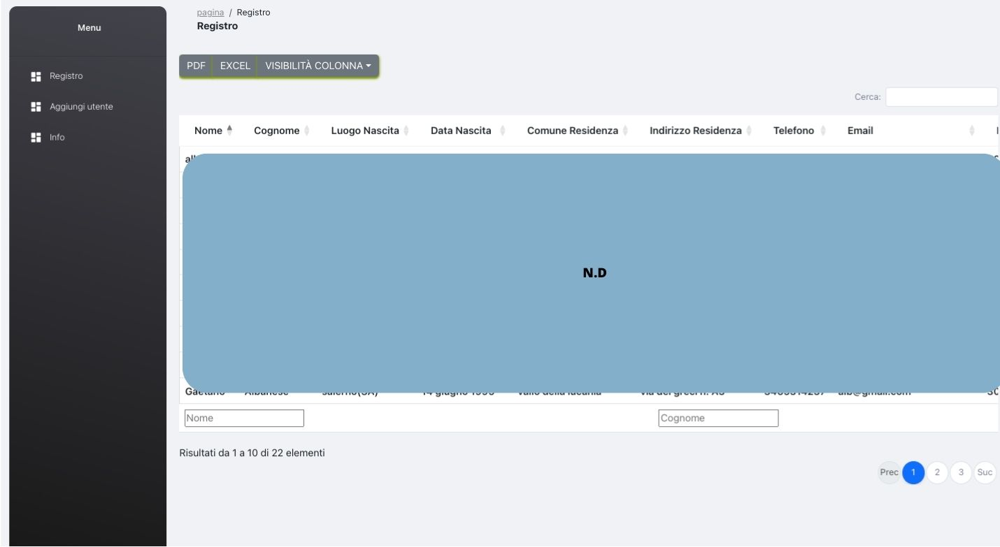
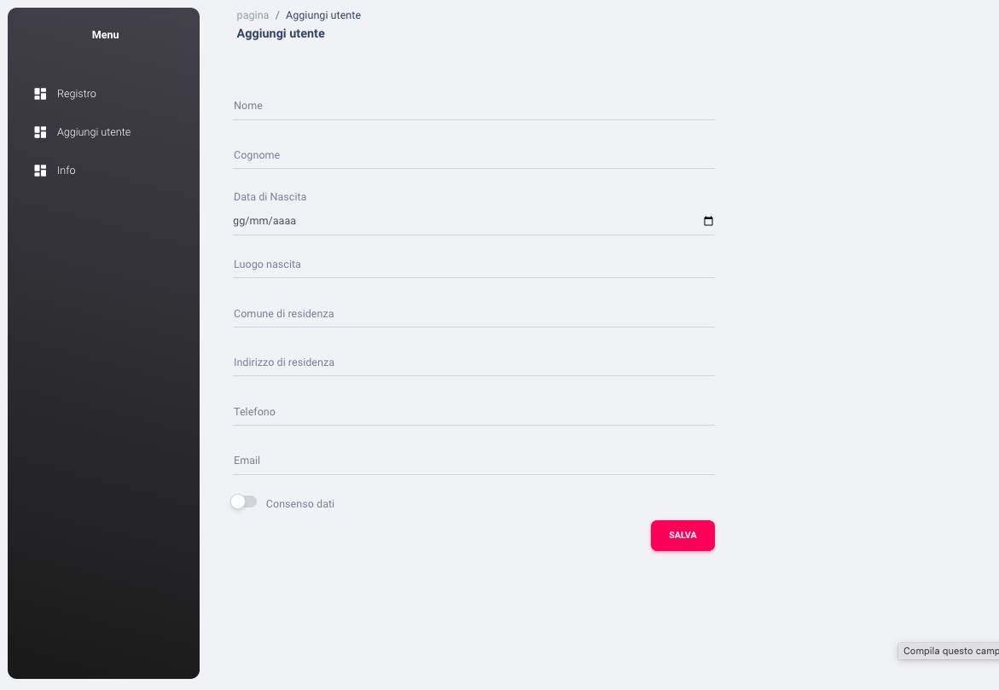

# member-register

Welcome to the "Register of Associates" repository! This open-source project aims to create a web application for managing a membership registry for an organization, association or club. The main goal is to provide a flexible and user-friendly system to track associate member information efficiently.

# Main Features
The "Register of Associates" project will offer several features to manage associates efficiently:

Adding and Editing Associates: Administrators will be able to add new associates to the registry by providing details such as first name, last name, address, contact details, date of enrollment and other relevant information. In addition, it will be possible to update the existing information of the associates, allowing you to keep the register always up to date.

#Search and Filters:

The registry will include advanced search and filter capabilities to quickly locate specific Associates based on criteria such as name, date of enrollment, and more.

this project is not finished yet, if you think it's interesting, don't hesitate to fork and modify this project.

# registro-membri

Benvenuto nel repository "Registro degli Associati"! Questo progetto open-source mira a creare un'applicazione web per la gestione di un registro di appartenenza per un'organizzazione, associazione o club. L'obiettivo principale è fornire un sistema flessibile e di facile utilizzo per tenere traccia delle informazioni sui membri associati in modo efficiente.

# Caratteristiche principali
Il progetto "Registro membri" offrirà diverse funzionalità per gestire gli associati in modo efficiente:

Aggiunta e modifica di associati: gli amministratori potranno aggiungere nuovi associati al registro fornendo dettagli come nome, cognome, indirizzo, dettagli di contatto, data di iscrizione e altre informazioni pertinenti. Inoltre, sarà possibile aggiornare le informazioni esistenti degli associati, consentendo di mantenere il registro sempre aggiornato.

#Ricerca e Filtri:

Il registro includerà funzionalità avanzate di ricerca e filtro per individuare rapidamente specifici associati in base a criteri quali nome, data di iscrizione e altro.

questo progetto non è ancora finito, se lo ritieni interessante, non esitare a forkare e modificare questo progetto.

#Views

